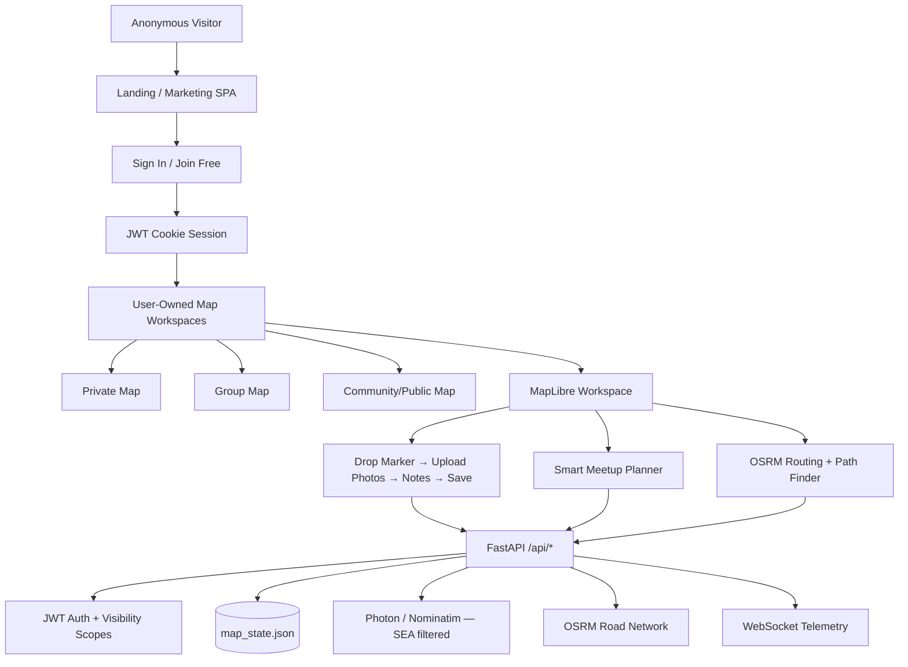

# TravelPlaces Platform Refactoring Architecture

This document describes the architectural updates implemented to transform TravelPlaces into an account-centric Southeast Asia travel workspace.

## A. Updated System Architecture



### Ownership model

```text
User (authenticated)
 ├── Default Map (auto-created)
 ├── Additional Maps (private | group | public)
 │    ├── Marker Posts (pins)
 │    │    ├── title, description (note)
 │    │    ├── coordinate
 │    │    ├── photos[]
 │    │    ├── visibility (scope)
 │    │    └── creator_id
 │    ├── Routes
 │    └── Meetup Requests (optional persist)
 └── Group membership (group_ids from JWT)
```

## B. Database / Data Model Changes

Persistent storage remains JSON (`backend/data/map_state.json`) with PostgreSQL/PostGIS-ready shapes.

### New collection: `user_maps`

| Field | Type | Notes |
| --- | --- | --- |
| map_id | string PK | UUID |
| title | string | Workspace name |
| description | string | Optional |
| scope | private \| group \| public | Same visibility model as pins |
| owner_id | string | Account owner |
| creator_id | string | Same as owner for now |
| group_ids | string[] | Group map collaborators |
| is_default | boolean | One default map per user |
| created_at / updated_at | ISO UTC | Timestamps |

### Extended `pins` (Marker Posts)

| Field | Type | Notes |
| --- | --- | --- |
| pin_id | string PK | Existing |
| map_id | string FK | Links pin to user map |
| photos | PhotoAttachment[] | Replaces standalone photo workflow |
| media | object | Primary photo (backward compatible) |
| title | string | Marker title |
| note | string | Travel notes / description |
| coordinate | {lat, lon} | Georeferenced location |
| scope | private \| group \| public | Unchanged |
| creator_id | string | Account owner |
| source | manual \| exif \| gps \| search | Unchanged |

### PhotoAttachment schema

```json
{
  "filename": "trip.jpg",
  "mime_type": "image/jpeg",
  "size_bytes": 12345,
  "preview_url": "blob:... or data:...",
  "thumbnail_url": "blob:...",
  "captured_at": "2026-06-17T12:00:00Z",
  "source": "upload | exif | gps | camera"
}
```

### New collection: `meetup_requests`

| Field | Type |
| --- | --- |
| request_id | string PK |
| creator_id | string |
| map_id | string (optional) |
| participants | LocationInput[] |
| midpoint | object |
| suggestions | MeetupSuggestion[] |
| created_at / updated_at | ISO UTC |

## C. Backend Modifications

| File | Changes |
| --- | --- |
| `core/sea_region.py` | **New** — SEA bounds, country list, coordinate validation |
| `core/meetup.py` | **New** — Weighted midpoint refinement, venue discovery, OSRM fairness ranking |
| `core/map_store.py` | User maps CRUD, `map_id`/`photos` on pins, meetup persistence, legacy migration |
| `core/mapping.py` | SEA search filtering, default region hint → Southeast Asia |
| `core/config.py` | `REGION_HINT` default → Southeast Asia |
| `models/mapping.py` | `UserMap*`, `Meetup*`, `PhotoAttachment`, extended `PinCreate` |
| `routers/mapping.py` | `/api/maps`, `/api/maps/default`, `/api/meetup/suggest`; auth required for maps/pins/meetup |

### New API endpoints

| Method | Path | Auth | Purpose |
| --- | --- | --- | --- |
| GET | `/api/maps` | Required | List user-owned maps |
| POST | `/api/maps` | Required | Create map workspace |
| GET | `/api/maps/default` | Required | Ensure/load default map |
| POST | `/api/meetup/suggest` | Required | Smart meetup recommendations |

## D. Frontend Modifications

| File | Changes |
| --- | --- |
| `App.tsx` | `/geo-photos` redirects to `/maps` |
| `Navbar.tsx` | Maps/Photos removed from public nav; Photos removed from member nav |
| `AuthContext.tsx` | Backend JWT login/session restore with mock signup fallback |
| `services/authApi.ts` | **New** — login/logout/me |
| `services/mappingApi.ts` | Maps, meetup, photos[], map_id on pins |
| `utils/seaBounds.ts` | **New** — SEA center, bounds, zoom defaults |
| `utils/photoPinHelpers.ts` | **New** — EXIF extraction, marker payload builder |
| `components/SmartMeetupPlanner.tsx` | **New** — Meetup UI with “Generate Another” |
| `components/MarkerFormModal.tsx` | **New** — Unified marker + photo + notes workflow |
| `components/MarkerDetailPanel.tsx` | **New** — Marker detail popup (comments future-ready) |
| `pages/MapsWorkspacePage.tsx` | Gated workspace, SEA bounds, marker modal, meetup planner, zoom-scaled photo markers |
| `pages/GeoreferencedPhotosPage.tsx` | Redirect to `/maps` |

## E. Migration Plan

### Phase 1 — Non-breaking schema migration (implemented)

1. On read, assign `map_id: "legacy-default"` to pins missing the field.
2. Copy existing `media` into `photos[]` when empty.
3. Existing pins/routes/tracking sessions continue to work.
4. New authenticated users receive a default map via `ensure_default_map()`.

### Phase 2 — Auth enforcement

1. Pin creation and map endpoints require authentication.
2. Frontend gates `/maps` behind `GatedPage`.
3. Public navigation no longer exposes map routes.
4. Login attempts backend JWT first; mock fallback preserved for local demo.

### Phase 3 — Feature consolidation

1. Remove standalone Photos page workflow (redirect only).
2. Marker form merges photo upload + travel notes.
3. Smart Meetup Planner uses backend OSRM fairness algorithm.

### Phase 4 — PostgreSQL/PostGIS (future)

1. Map `user_maps`, `pins`, `routes`, `meetup_requests` to relational tables.
2. Store photo binaries in object storage; keep metadata in DB.
3. Add PostGIS indexes for SEA bounding queries and meetup venue search.
4. Replace JSON file writer with transactional DB + optional Redis cache.

### Rollback strategy

- Legacy pins retain `legacy-default` map_id.
- `media` field preserved alongside `photos[]`.
- `/geo-photos` route redirects rather than deletes code paths immediately.

## Southeast Asia constraints

- Default map center: `[115.0, 6.5]` (lng/lat)
- Map max bounds: `[92, -11]` to `[141.5, 28.5]`
- Geocoding search filtered to SEA countries
- Region hint appended to queries: `Southeast Asia`

## Smart Meetup Planner algorithm

1. Resolve participant locations via geocoder.
2. Compute geographic centroid (extensible to N participants).
3. Refine midpoint iteratively using OSRM max-travel-time minimization.
4. Discover venues near midpoint (restaurants, cafes, malls, parks, attractions).
5. Exclude hotels, residential, closed locations.
6. Rank venues by fairness score (minimize travel-time spread).
7. “Generate Another” excludes prior suggestions and randomizes among next-best options.

## Known follow-ups

- Move photo storage from client blob URLs to server-side object storage.
- Wire signup to a real user registry (currently mock signup + bootstrap login).
- Add pin update/delete endpoints.
- Add comment threads on marker detail panel.
- Symbol-layer photo thumbnails once images are served from durable URLs.
