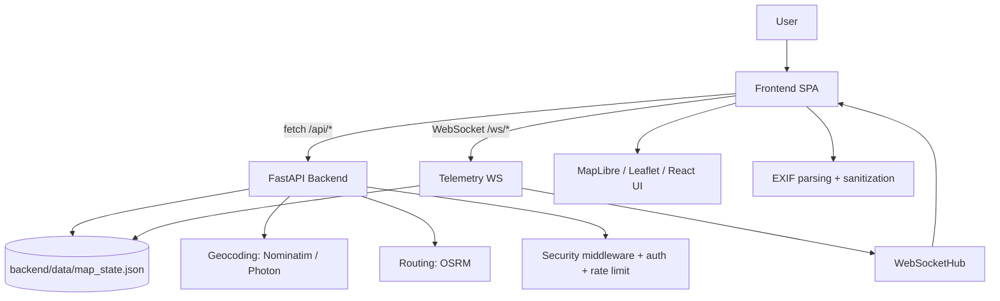
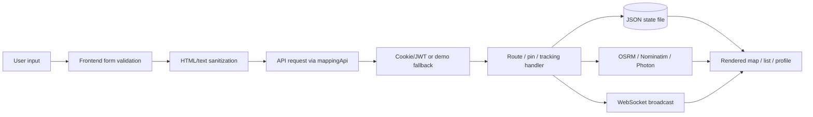
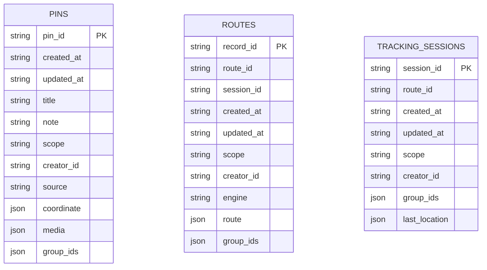
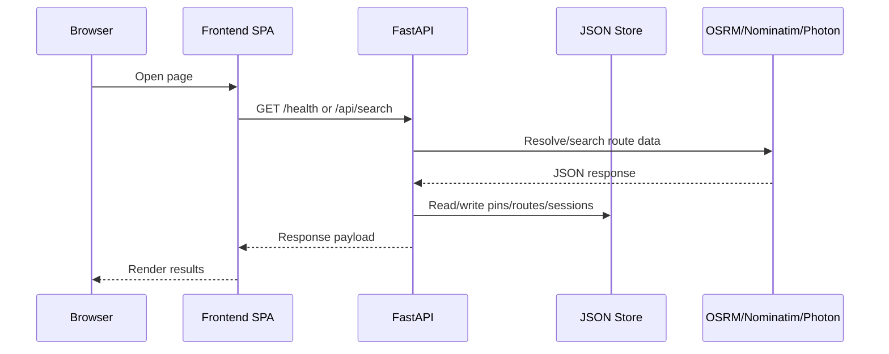
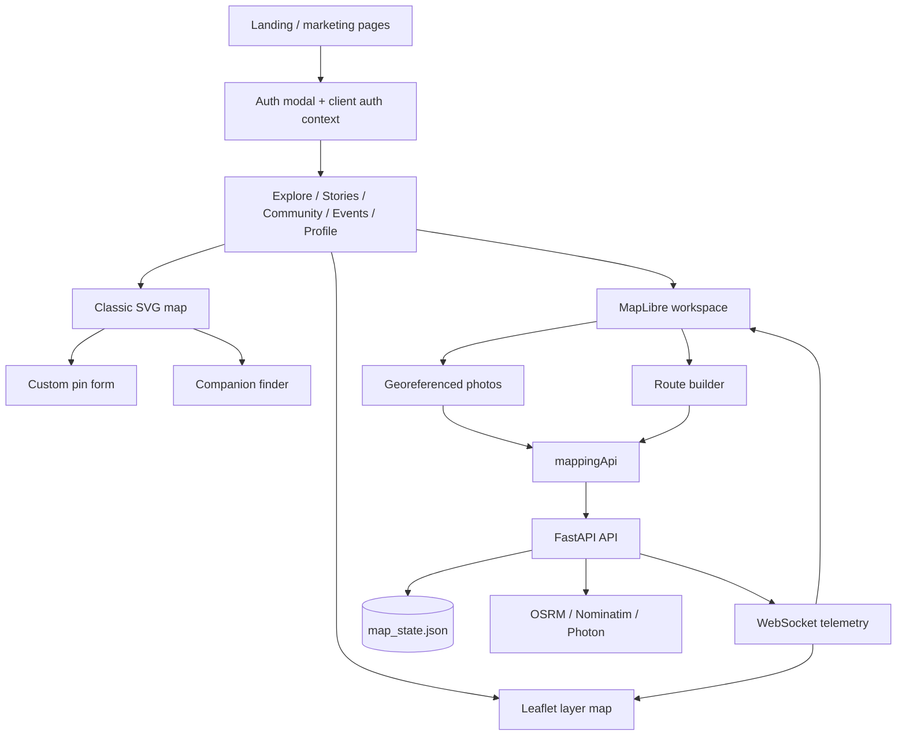

# TravelPlaces Technical Documentation

## Scope and methodology

This document describes the authored source code in the `TravelPlaces` project and the project-owned assets/configuration that directly shape runtime behavior. Large vendored directories and generated build artifacts are present in the archive as well, but they are collapsed into summary nodes rather than expanded line-by-line:

- `backend/.venv/` — Python virtual environment and installed third-party packages.
- `frontend/node_modules/` — JavaScript dependency tree.
- `frontend/dist/` — built frontend output.
- `backend/app/__pycache__/`, frontend caches, and runtime logs — generated artifacts.

The application itself is a two-tier system: a FastAPI backend and a Vite/React frontend.

## 1. Project overview

**Project name:** TravelPlaces
**Public-facing brand in the UI:** TravelTraces

**Purpose:** a community travel platform centered on documenting Philippine travel experiences, map-based pinning, route planning, georeferenced media, social discovery, and live tracking.

**Main objectives**
- help users discover places and record personal travel memories
- provide map-centric workflows for pins, stories, routes, and photos
- support community features such as profiles, events, chat, and companion discovery
- expose a reusable mapping/routing/telemetry backend for future phases

**Target users**
- casual travelers who want to save destinations and memories
- community members who publish stories and participate in events
- maintainers/admins who need route, pin, and tracking infrastructure
- future AI agents that need a compact but accurate project summary

**Key problems solved**
- travel memory capture is fragmented across separate tools; TravelPlaces unifies places, stories, media, and routing
- location discovery and reverse geocoding are built into the app
- a private/group/public visibility model supports scoped sharing
- live tracking and websocket telemetry are available for ongoing trip sessions

**Overall workflow**
1. The user opens the React SPA.
2. Public pages expose the brand and feature set; members-only pages gate access through the client-side auth context.
3. Frontend map pages call the backend via `mappingApi.ts`.
4. The backend resolves locations, builds routes, stores pin/route/session data in `data/map_state.json`, and optionally publishes live telemetry over WebSockets.
5. The UI renders the resulting routes, pins, geotagged photos, or tracking updates.

## 2. Project architecture

### High-level architecture



### Architectural notes

The backend is layered in a conventional FastAPI style:
- **main/app bootstrap**: `app/main.py`
- **middleware**: security headers and request-size enforcement
- **routers**: auth, mapping, telemetry
- **domain/core services**: geocoding, routing, tracking, token signing, validation
- **persistence**: a JSON file store instead of a relational database

The frontend is a routed SPA:
- **layout/router**: `App.tsx`
- **state**: `AuthContext.tsx`
- **API client**: `mappingApi.ts`
- **feature pages**: landing, explore, stories, maps, workspace, photos, community, events, profile, pricing, legal
- **supporting components**: modal dialogs, gates, navbar, footer, chat, gamification, map tools

### Deployment architecture

- Local development: `run.cmd` can bootstrap both stacks on Windows.
- Production containerization: `backend/docker-compose.yml` defines `api`, `redis`, and `web` services.
- Web tier: Nginx serves the built SPA and reverse-proxies `/api` and `/ws`.
- API tier: Uvicorn serves FastAPI.
- Redis: optional but recommended for login rate limiting.
- Persistent state: `/app/data/map_state.json` on a volume mount.

## 3. Directory structure analysis

### Tree

```text
TravelPlaces/
├── backend/
│   ├── app/
│   │   ├── core/
│   │   │   ├── auth.py
│   │   │   ├── config.py
│   │   │   ├── map_store.py
│   │   │   ├── mapping.py
│   │   │   ├── rate_limit.py
│   │   │   ├── safe_parsing.py
│   │   │   ├── security.py
│   │   │   ├── security_headers.py
│   │   │   └── validation.py
│   │   ├── models/
│   │   │   ├── auth.py
│   │   │   ├── mapping.py
│   │   │   └── telemetry.py
│   │   └── routers/
│   │       ├── auth.py
│   │       ├── mapping.py
│   │       └── telemetry.py
│   ├── data/
│   │   └── map_state.json
│   ├── docker/
│   │   ├── backend.Dockerfile
│   │   ├── frontend.Dockerfile
│   │   └── README.md
│   ├── nginx/
│   │   └── nginx.conf
│   ├── requirements.txt
│   ├── .env.example
│   └── README.md
├── frontend/
│   ├── public/
│   │   ├── data/
│   │   │   └── philippines-municipal-boundaries.geojson
│   │   └── favicon.svg
│   ├── src/
│   │   ├── components/
│   │   ├── context/
│   │   ├── pages/
│   │   ├── security/
│   │   ├── services/
│   │   ├── styles/
│   │   └── utils/
│   ├── imports/
│   │   ├── Allen.jpg
│   │   ├── Hershey.jpg
│   │   └── Kayeen.jpg
│   ├── index.html
│   ├── metadata.json
│   ├── package.json
│   ├── tsconfig.json
│   ├── vite.config.ts
│   ├── .env.example
│   └── README.md
└── run.cmd

```

### Directory responsibilities

`backend/` contains the API, deployment assets, and the JSON persistence store. If removed, all server-side functionality disappears.

`frontend/` contains the SPA source, public assets, and build tooling. If removed, the user-facing application disappears.

`run.cmd` is a developer convenience launcher. If removed, the project still runs manually, but local setup becomes more cumbersome.

### Non-authored directories present in the archive

`backend/.venv/`, `frontend/node_modules/`, `frontend/dist/`, `__pycache__` folders, and log files are runtime/build artifacts or vendored dependency caches. They matter operationally, but they are not useful to document file-by-file because they are not project-authored source.

## 4. File-by-file documentation

### Backend source files

| File | Purpose | If removed |
| --- | --- | --- |
| backend/app/main.py | FastAPI application factory and entrypoint. Registers CORS, security middleware, root/health routes, and the auth/mapping/telemetry routers. | App would not start; no HTTP API, no docs, no router registration. |
| backend/app/core/config.py | Central configuration loader. Reads environment variables into an immutable Settings object and exposes runtime limits and service URLs. | Environment handling, secrets, CORS, rate limits, and external service URLs would break. |
| backend/app/core/auth.py | JWT cookie authentication, password verification, request actor resolution, group authorization, and session cookie management. | Authentication, login, and authorization checks would fail. |
| backend/app/core/map_store.py | Thread-safe JSON document store for pins, routes, and tracking sessions with scoped visibility rules. | Persisted pins/routes/sessions would be unavailable; APIs that read/write them would fail. |
| backend/app/core/mapping.py | Core geocoding, routing, ETA, geofence, and WebSocket tracking engine. Includes OSRM/Nominatim/Photon integration and graph-routing fallbacks. | Search, reverse geocoding, route building, tracking progress, and websocket broadcasting would fail. |
| backend/app/core/rate_limit.py | Login throttling helper using Redis when available and an in-memory fallback otherwise. | Login abuse protection would disappear. |
| backend/app/core/safe_parsing.py | JSON object parser with size checks and explicit rejection helpers for unsafe pickle/YAML loaders. | WebSocket event parsing would be weaker; unsafe loader protections would be absent. |
| backend/app/core/security.py | HMAC-signed token creation and verification for WebSocket session authorization. | Tracking session token issuance and validation would fail. |
| backend/app/core/security_headers.py | HTTP middleware for response headers, request-size enforcement, and CSP hardening. | Security headers, body-size limits, and no-store behavior would be missing. |
| backend/app/core/validation.py | Text sanitization, safe ID/email validation, HTML cleaning, and custom graph schema validation. | Input validation and XSS/safety controls would be weakened. |

| File | Purpose | If removed |
| --- | --- | --- |
| backend/app/models/auth.py | Pydantic request/response schemas for login and current-user identity. | Auth endpoints would lose request/response validation. |
| backend/app/models/mapping.py | Schemas for geocoding, routing, pins, and persisted route records. | Mapping endpoint validation and typed responses would break. |
| backend/app/models/telemetry.py | Schemas for tracking sessions, websocket token requests, and telemetry events. | Tracking API validation would break. |

| File | Purpose | If removed |
| --- | --- | --- |
| backend/app/routers/auth.py | POST /api/auth/login, POST /api/auth/logout, GET /api/auth/me. Implements bootstrap credential login and session cookie lifecycle. | No auth endpoints; frontend login modal would have no backend counterpart. |
| backend/app/routers/mapping.py | GET /api/health, GET /api/search, GET /api/reverse, POST /api/route, POST /api/routes, POST /api/routes/driving, GET /api/pins, POST /api/pins, GET /api/routes. Resolves locations, builds routes, and persists scoped pins/routes. | Core mapping, geocoding, pinning, and route persistence would stop working. |
| backend/app/routers/telemetry.py | POST /api/tracking/sessions, POST /api/tracking/token, WS /ws/{session_id}. Creates tracking sessions and relays live location updates. | Live telemetry and session-based tracking would stop working. |

### Frontend source files

| File | Purpose | If removed |
| --- | --- | --- |
| frontend/src/main.tsx | React root bootstrap. Mounts App inside StrictMode and loads global CSS. | The frontend would not render. |
| frontend/src/App.tsx | Top-level router and layout shell. Wraps the app in AuthProvider, renders Navbar/Footer/AuthModal, and maps URLs to pages. | Navigation, page routing, and layout composition would fail. |
| frontend/src/context/AuthContext.tsx | Client-side auth state, mock login/signup/logout behavior, plan limits, and modal state. | The current frontend would lose authentication gating and plan-limit logic. |
| frontend/src/services/mappingApi.ts | Typed fetch wrapper for backend mapping and telemetry endpoints, including route creation, pin CRUD, and tracking session/token requests. | Frontend would no longer communicate with the backend API cleanly. |
| frontend/src/utils/workspaceSync.ts | Cross-tab workspace event broadcaster/subscriber using BroadcastChannel and localStorage fallback. | Pin/route changes would not sync across tabs/windows. |
| frontend/src/security/sanitize.ts | DOMPurify-based rich text sanitization with a narrow style whitelist. | Rich-text notes would be less safe. |
| frontend/src/utils/mapHelpers.ts | Static companion/hub data, screen-space distance helpers, region inference, and seeded pin dataset for the classic map view. | Legacy map interactions and visual helpers would lose data and calculations. |

| File | Purpose | If removed |
| --- | --- | --- |
| frontend/src/components/AuthModal.tsx | Signup/login modal with form validation and navigation after mock auth. | Users could not open or submit the auth modal. |
| frontend/src/components/ChatPanel.tsx | Messenger-style overlay with conversation list, threaded messages, and profile card integration. | The chat UI launched from the navbar would disappear. |
| frontend/src/components/CompanionFinder.tsx | Suggests companion matches and midpoint hubs from static companion data and map-space coordinates. | The map-side companion matching feature would be unavailable. |
| frontend/src/components/Footer.tsx | Site footer and legal/navigation links. | Global footer links would be missing. |
| frontend/src/components/GatedPage.tsx | Reusable members-only gate that opens the auth modal for anonymous users. | Protected pages would need custom gating logic. |
| frontend/src/components/MapCustomForm.tsx | Rich text pin/story composer for the classic map, including formatting, image selection, and sanitization. | Users could not create the formatted map notes/pins UI. |
| frontend/src/components/Navbar.tsx | Primary navigation with public/member link sets, profile menu, chat launcher, and auth controls. | The app would lose its global navigation shell. |
| frontend/src/components/UpgradeModal.tsx | Plan-upgrade call-to-action shown when free-tier limits are reached. | Free-tier limit prompts would not appear. |
| frontend/src/components/gamification.ts | Static XP/level/badge rules and sample gamified users. | Gamification-driven UI would lose its data model. |
| frontend/src/components/maps/LayerMapInterface.tsx | Leaflet-based layer map with georeferenced media, route lines, pin rendering, and live tracking integration. | The layered map page would have no interactive map engine. |

| File | Purpose | If removed |
| --- | --- | --- |
| frontend/src/pages/LandingPage.tsx | Public landing page, feature overview, CTAs, and marketing content. | The home page would be missing. |
| frontend/src/pages/AboutPage.tsx | About/brand story page with team profiles and company narrative. | The brand story page would be missing. |
| frontend/src/pages/PricingPage.tsx | Plan comparison page describing Free/Explorer/Pathfinder limits and upgrade paths. | Pricing and upgrade guidance would be missing. |
| frontend/src/pages/ContactPage.tsx | Static contact form and contact details. | Contact page would vanish. |
| frontend/src/pages/HelpPage.tsx | FAQ/help center with account, mapping, community, and technical questions. | Help content would be missing. |
| frontend/src/pages/PrivacyPolicyPage.tsx | Legal/privacy policy content. | Privacy policy page would be missing. |
| frontend/src/pages/TermsOfServicePage.tsx | Legal terms page. | Terms page would be missing. |
| frontend/src/pages/ExplorePage.tsx | Destination discovery page with cards, filters, profile overlays, and ranking data. | Destination browsing would be missing. |
| frontend/src/pages/StoriesPage.tsx | Story feed page with search, reactions, comments, and author profiles. | The story browsing experience would be missing. |
| frontend/src/pages/MapPage.tsx | Classic interactive map page using the SVG/coordinate-based map, custom pin notes, and companion finder. | The legacy map experience would be missing. |
| frontend/src/pages/MappingLayerPage.tsx | Simple wrapper around the layered map interface behind a members gate. | The layer map route would not render. |
| frontend/src/pages/MapsWorkspacePage.tsx | Main advanced workspace combining MapLibre, search, routing, pin creation, photos, exports, and cross-tab sync. | The flagship workspace feature would be missing. |
| frontend/src/pages/GeoreferencedPhotosPage.tsx | Photo upload and geolocation page with EXIF extraction, map preview, and pin creation. | Geotagged photo workflows would fail. |
| frontend/src/pages/CommunityPage.tsx | Community directory and social discovery page. | Community browsing would be missing. |
| frontend/src/pages/EventsPage.tsx | Events listing page with organizers, attendance, and profile overlays. | Events browsing and RSVP-like UI would be missing. |
| frontend/src/pages/ProfilePage.tsx | Member profile dashboard with albums, stats, and membership tier labels. | The user profile dashboard would be missing. |

### Configuration, assets, and deployment files

| File | Purpose | If removed |
| --- | --- | --- |
| backend/requirements.txt | Pinned backend runtime dependencies. | Required to install and run the FastAPI service. |
| backend/.env.example | Production-like backend environment template. | Documents required secrets and service URLs. |
| backend/docker-compose.yml | Production container stack for API, Redis, and Nginx web tier. | Defines the deployment topology. |
| backend/docker/backend.Dockerfile | Backend image build recipe. | Used by docker compose. |
| backend/docker/frontend.Dockerfile | Frontend build-and-serve image recipe. | Used by docker compose. |
| backend/docker/README.md | Container deployment notes. | Explains compose usage and scaling. |
| backend/nginx/nginx.conf | Reverse proxy, security headers, compression, rate limits, and route proxying. | Used in the production web container. |
| backend/data/map_state.json | Seeded JSON persistence store for pins, routes, and tracking sessions. | Loaded and mutated by ScopedMapStore. |
| frontend/package.json | Frontend dependencies and scripts. | Used for install/build/dev tooling. |
| frontend/tsconfig.json | TypeScript compiler settings. | Used by Vite/tsc. |
| frontend/vite.config.ts | Vite dev-server and build configuration, including API proxy. | Used by local development and builds. |
| frontend/index.html | SPA shell HTML entrypoint. | Bootstraps the React app. |
| frontend/metadata.json | AI Studio metadata and app description. | Template metadata for the project wrapper. |
| frontend/.env.example | Frontend environment template. | Documents Vite API base/proxy settings. |
| frontend/public/favicon.svg | Site favicon asset. | Used by index.html. |
| frontend/public/data/philippines-municipal-boundaries.geojson | GeoJSON boundary dataset for the map layer. | Consumed by the layered map UI. |
| frontend/public/creator-profiles/Allen.jpg | Team portrait asset. | Used on the About page. |
| frontend/public/creator-profiles/Hershey.jpg | Team portrait asset. | Used on the About page. |
| frontend/public/creator-profiles/Kayeen.jpg | Team portrait asset. | Used on the About page. |
| run.cmd | Windows bootstrap script to install dependencies and run backend/frontend/website stacks. | Convenience launcher for local development. |

## 5. Dependency mapping

### Backend dependency map

```text
backend/app/main.py
 ├── app/core/config.py
 ├── app/core/security_headers.py
 ├── app/routers/auth.py
 ├── app/routers/mapping.py
 └── app/routers/telemetry.py

backend/app/routers/auth.py
 ├── app/core/auth.py
 ├── app/core/config.py
 ├── app/core/rate_limit.py
 └── app/models/auth.py

backend/app/routers/mapping.py
 ├── app/core/auth.py
 ├── app/core/config.py
 ├── app/core/map_store.py
 ├── app/core/mapping.py
 ├── app/core/validation.py
 └── app/models/mapping.py

backend/app/routers/telemetry.py
 ├── app/core/auth.py
 ├── app/core/config.py
 ├── app/core/map_store.py
 ├── app/core/mapping.py
 ├── app/core/safe_parsing.py
 ├── app/core/security.py
 └── app/models/telemetry.py
```

### Frontend dependency map

```text
frontend/src/main.tsx
 ├── App.tsx
 └── index.css

frontend/src/App.tsx
 ├── context/AuthContext.tsx
 ├── components/Navbar.tsx
 ├── components/Footer.tsx
 ├── components/AuthModal.tsx
 └── pages/*
```

### Dependency matrix for major modules

| Module | Depends on |
| --- | --- |
| backend/app/main.py | settings, middleware, routers |
| backend/app/routers/mapping.py | auth, config, store, mapping engine, models |
| backend/app/routers/telemetry.py | auth, config, store, mapping engine, safe parsing, signed tokens |
| frontend/src/App.tsx | auth context, layout, all pages |
| frontend/src/pages/MapsWorkspacePage.tsx | API client, sync helper, MapLibre, EXIF parsing |
| frontend/src/components/maps/LayerMapInterface.tsx | API client, auth context, Leaflet, EXIF parsing |

### Circular dependencies

No obvious circular dependencies were found in the authored import graph.

## 6. Data flow documentation



### Step-by-step flow

1. The user submits a location, pin, route, photo, or telemetry action in the frontend.
2. The frontend validates and sanitizes the input again before sending it over `fetch` or WebSocket.
3. `mappingApi.ts` attaches JSON headers and browser cookies, then sends the request.
4. The backend validates the request with Pydantic models and field validators.
5. The backend may resolve a location through Photon or Nominatim, compute a route through OSRM or the graph engine, or store a scoped record in `map_state.json`.
6. For live tracking, the backend issues a signed WebSocket token and then forwards telemetry updates to the hub.
7. The frontend receives the response or broadcast and updates the map/list/profile UI.

## 7. Feature breakdown

### Authentication

- **Files involved:** `backend/app/routers/auth.py`, `backend/app/core/auth.py`, `frontend/src/context/AuthContext.tsx`, `frontend/src/components/AuthModal.tsx`, `frontend/src/components/GatedPage.tsx`
- **User workflow:** open auth modal, enter login/signup data, unlock members-only pages
- **Backend workflow:** validate bootstrap credentials, issue JWT cookie, enforce optional auth
- **Important note:** the current frontend uses an in-memory mock auth context. The backend auth endpoints exist and are documented, but the SPA is not yet wired to them.

### Mapping and pinning

- **Files involved:** `backend/app/routers/mapping.py`, `backend/app/core/mapping.py`, `backend/app/core/map_store.py`, `frontend/src/pages/MapPage.tsx`, `frontend/src/pages/MapsWorkspacePage.tsx`, `frontend/src/pages/GeoreferencedPhotosPage.tsx`, `frontend/src/components/MapCustomForm.tsx`, `frontend/src/components/maps/LayerMapInterface.tsx`
- **User workflow:** search a place, reverse geocode a coordinate, add a pin, or build a route
- **Backend workflow:** sanitize input, resolve locations, compute routes, serialize results, optionally persist
- **Database interaction:** JSON persistence via `ScopedMapStore`

### Companion discovery and community map

- **Files involved:** `frontend/src/components/CompanionFinder.tsx`, `frontend/src/utils/mapHelpers.ts`, `frontend/src/pages/MapPage.tsx`
- **User workflow:** compare a traveler’s position with companions and suggested midpoint hubs
- **Behavior:** entirely client-side/static data in the current implementation

### Stories, events, profiles, and community

- **Files involved:** `frontend/src/pages/StoriesPage.tsx`, `frontend/src/pages/EventsPage.tsx`, `frontend/src/pages/ProfilePage.tsx`, `frontend/src/pages/CommunityPage.tsx`, `frontend/src/pages/PublicProfilePage.tsx`, `frontend/src/components/gamification.ts`
- **Behavior:** social content is largely static/mock data driven in the current codebase, designed to showcase the product story and interaction patterns

### Live tracking

- **Files involved:** `backend/app/routers/telemetry.py`, `backend/app/core/security.py`, `backend/app/core/map_store.py`, `frontend/src/services/mappingApi.ts`, `frontend/src/components/maps/LayerMapInterface.tsx`, `frontend/src/pages/MapsWorkspacePage.tsx`
- **Behavior:** create a tracking session, obtain a signed token, then stream location updates over WebSocket

## 8. Database documentation

There is **no relational database** or ORM in the project. Persistent state is stored in a JSON document at `backend/data/map_state.json`.

### Logical collections

### Pins
- `pin_id` — logical primary key
- `created_at`, `updated_at`
- `group_ids`
- `media`
- `title`
- `note`
- `coordinate`
- `scope`
- `creator_id`
- `source`

### Routes
- `record_id` — logical primary key
- `route_id`
- `session_id`
- `route`
- `scope`
- `creator_id`
- `group_ids`
- `engine`
- `created_at`, `updated_at`

### Tracking sessions
- `session_id` — logical primary key
- `route_id`
- `scope`
- `creator_id`
- `group_ids`
- `last_location`
- `created_at`, `updated_at`

### Relationships

- routes are associated with route IDs and session IDs
- tracking sessions can reference route IDs
- group visibility is enforced at the application level, not by foreign keys
- there are no declared SQL constraints; all validation is handled in code



## 9. API documentation

### Authentication API

| Route | Method | Request | Response |
| --- | --- | --- | --- |
| `/api/auth/login` | POST | `LoginRequest {{ email, password }}` | `AuthUserResponse` and an HttpOnly session cookie |
| `/api/auth/logout` | POST | none | `{{"status":"ok"}}` and clears the cookie |
| `/api/auth/me` | GET | authenticated cookie | `AuthUserResponse` |

**Login request**
```json
{{"email":"admin@example.com","password":"strong-password"}}
```

**Login response**
```json
{{"user_id":"admin","email":"admin@example.com","group_ids":["ops","travelers"],"token_expires_at":1710000000}}
```

### Mapping API

| Route | Method | Request | Response |
| --- | --- | --- | --- |
| `/api/health` | GET | none | `{{"status":"ok","service":"mapping"}}` |
| `/api/search` | GET | `query`, `limit` | `SearchResponse` |
| `/api/reverse` | GET | `lat`, `lon` | `LocationResponse` |
| `/api/route` | POST | `RouteRequest` | `RouteResponse` |
| `/api/routes` | POST | same as `/api/route` | `RouteResponse` |
| `/api/routes/driving` | POST | same as `/api/route` | `RouteResponse` |
| `/api/pins` | GET | `viewer_id`, `group_ids` | `PinsResponse` |
| `/api/pins` | POST | `PinCreate` | `PinRecord` |
| `/api/routes` | GET | `viewer_id`, `group_ids` | `RoutesResponse` |

**Search response example**
```json
{{
  "query": "Manila",
  "results": [
    {{
      "coordinate": [14.5995, 120.9842],
      "label": "Manila, Metro Manila, Philippines",
      "provider": "photon",
      "confidence": 0.98
    }}
  ]
}}
```

**Route request example**
```json
{{
  "origin": {{"query":"Manila"}},
  "destination": {{"lat":14.5995,"lon":120.9842,"label":"Manila"}},
  "waypoints": [],
  "mode": "fastest",
  "engine": "osrm",
  "session_id": null,
  "scope": "private",
  "creator_id": "demo-user",
  "group_ids": [],
  "persist": true,
  "custom_graph": null
}}
```

### Telemetry API

| Route | Method | Request | Response |
| --- | --- | --- | --- |
| `/api/tracking/sessions` | POST | `TrackingSessionCreate` | `TrackingSessionResponse` |
| `/api/tracking/token` | POST | `TrackingTokenRequest` | `TrackingTokenResponse` |
| `/ws/{session_id}` | WS | `token` query parameter + telemetry events | live event stream |

**WebSocket event types**
- `session.accepted`
- `location.updated`
- `route.rerouted`
- `pong`
- `error`

## 10. Configuration documentation

### Backend environment variables

| Variable | Purpose |
| --- | --- |
| APP_NAME | Service display name |
| APP_ENV | Runtime environment label |
| API_CORS_ORIGINS | Allowed browser origins |
| OSRM_URL | OSRM routing service URL |
| NOMINATIM_URL | Reverse geocoding service URL |
| PHOTON_URL | Search/geocoding service URL |
| REGION_HINT | Bias for location search |
| WS_SESSION_SECRET | Signing key for tracking session tokens |
| WS_TOKEN_TTL_S | Tracking token lifetime |
| MAX_REQUEST_BYTES | Maximum HTTP request body size |
| MAX_WS_MESSAGE_BYTES | Maximum WebSocket message size |
| REDIS_URL | Optional Redis endpoint for login throttling |
| REQUIRE_AUTH | Force auth for request actor resolution |
| AUTH_SECRET | JWT signing secret |
| AUTH_ISSUER | JWT issuer |
| AUTH_AUDIENCE | JWT audience |
| AUTH_COOKIE_NAME | Name of the session cookie |
| AUTH_COOKIE_SECURE | Secure-cookie flag |
| AUTH_TOKEN_TTL_S | JWT/cookie lifetime |
| LOGIN_RATE_LIMIT_COUNT | Allowed login attempts per window |
| LOGIN_RATE_LIMIT_WINDOW_S | Rate limit window |
| BOOTSTRAP_USER_EMAIL | Bootstrap login email |
| BOOTSTRAP_USER_ID | Bootstrap user id |
| BOOTSTRAP_USER_PASSWORD_HASH | Bootstrap password hash |
| BOOTSTRAP_USER_GROUP_IDS | Groups assigned on login |

### Frontend environment variables

- `VITE_API_BASE_URL` — optional absolute backend URL; empty means use the current origin.
- `VITE_API_PROXY_TARGET` — dev-server proxy target for `/api` and `/ws`.

### Build and deployment settings

- `frontend/vite.config.ts` proxies `/api` and `/ws` during development.
- `backend/nginx/nginx.conf` enforces request rate limiting, security headers, gzip, and WebSocket forwarding.
- `backend/docker-compose.yml` injects production environment variables and mounts the JSON data volume.

## 11. External libraries and packages

### Backend packages

| Package | Version | Purpose | Files Using It |
| --- | --- | --- | --- |
| fastapi | >=0.115,<1.0 | API framework and OpenAPI docs | main.py, routers/* |
| uvicorn[standard] | >=0.34,<1.0 | ASGI server | run.cmd, Dockerfile |
| httpx | >=0.28,<1.0 | Async HTTP client for geocoding/routing | core/mapping.py |
| polyline | >=2.0,<3.0 | Decode OSRM polylines | core/mapping.py |
| pydantic | >=2.10,<3.0 | Runtime schema validation | models/* |
| websockets | >=10.4 | WebSocket runtime support | telemetry endpoints |
| bleach | >=6.1,<7.0 | Server-side HTML sanitization | core/validation.py |
| PyJWT | >=2.10,<3.0 | JWT encode/decode | core/auth.py |
| argon2-cffi | >=23.1,<26.0 | Password hashing/verification | core/auth.py |
| redis | >=5.0,<6.0 | Login rate limiting backend | core/rate_limit.py |

### Frontend packages

| Package | Version | Purpose | Files Using It |
| --- | --- | --- | --- |
| react | ^19.0.1 | UI runtime | App, pages, components |
| react-dom | ^19.0.1 | DOM renderer | main.tsx |
| react-router | ^7.17.0 | Client-side routing | App, Navbar, AuthModal |
| leaflet | ^1.9.4 | Legacy leaflet map engine | LayerMapInterface |
| react-leaflet | ^5.0.0 | React bindings for Leaflet | LayerMapInterface |
| maplibre-gl | ^5.24.0 | MapLibre map engine | MapsWorkspacePage, GeoreferencedPhotosPage |
| exifr | ^7.1.3 | EXIF metadata parsing | photo/map upload pages |
| dompurify | ^3.4.10 | Client-side HTML sanitization | security/sanitize.ts |
| lucide-react | ^0.546.0 | Icon set | UI components/pages |
| motion | ^12.23.24 | Animations | UI components/pages |
| @tailwindcss/vite | ^4.1.14 | Tailwind Vite plugin | vite.config.ts |
| tailwindcss | ^4.1.14 | Utility CSS framework | index.css, styling |
| typescript | ~5.8.2 | Type checking | tsconfig/lint |
| vite | ^8.0.16 | Dev server and build tool | vite.config.ts, scripts |
| @vitejs/plugin-react | ^6.0.2 | React plugin | vite.config.ts |

## 12. Execution flow



### Startup sequence

1. `run.cmd`, `uvicorn`, or Docker starts the backend.
2. `app/main.py` creates the FastAPI app, attaches middleware, and includes routers.
3. The frontend builds or starts through Vite, then loads `main.tsx`.
4. `App.tsx` mounts the router, navbar, footer, and auth modal.
5. On first data use, pages call `mappingApi.ts`, which targets the backend API.
6. The backend reads configuration, validates inputs, and calls the geocoding/routing services or the JSON store.
7. WebSocket telemetry sessions are established only after token issuance and validation.

## 13. Developer guide

### Install

Backend:
```powershell
python -m pip install -r backend/requirements.txt
```

Frontend:
```powershell
cd frontend
npm install
```

### Run locally

Backend:
```powershell
python -m uvicorn app.main:app --reload --host 0.0.0.0 --port 8000
```

Frontend:
```powershell
npm run dev
```

Full Windows bootstrap:
```powershell
run.cmd website
```

### Build

Frontend:
```powershell
npm run build
```

Docker stack:
```powershell
docker compose up --build
```

### Test and verify

There is no dedicated automated test suite in the archive. The practical verification path is:
- open `/health` and `/api/health`
- exercise `/api/search`, `/api/reverse`, and `/api/routes`
- create a pin and confirm it appears in `data/map_state.json`
- create a tracking session and verify websocket messages

### Troubleshooting

- If login fails, check that the bootstrap auth variables are set and that the password hash is a valid Argon2 string.
- If geocoding or routing fails, confirm network access to OSRM, Nominatim, and Photon.
- If map data does not persist in Docker, check the mounted volume and file permissions.
- If WebSocket updates do not appear, verify the token query parameter and Nginx proxy upgrade settings.

## 14. AI QUICK CONTEXT

**Project summary:** TravelPlaces is a Philippine travel platform with a FastAPI backend and a React/Vite frontend. It supports geocoding, routing, pinned places, georeferenced photos, community-style content, member gating, and live telemetry.

**Technology stack:** FastAPI, Pydantic, Uvicorn, JWT, Argon2, Redis (optional), React 19, TypeScript, Vite, Leaflet, MapLibre, DOMPurify, EXIF parsing, Nginx, Docker.

**Main modules:** `backend/app/core/*`, `backend/app/models/*`, `backend/app/routers/*`, `frontend/src/context/AuthContext.tsx`, `frontend/src/services/mappingApi.ts`, `frontend/src/pages/MapsWorkspacePage.tsx`, `frontend/src/components/maps/LayerMapInterface.tsx`, `frontend/src/pages/MapPage.tsx`.

**Important files:** `backend/app/main.py`, `backend/app/core/mapping.py`, `backend/app/core/map_store.py`, `backend/app/routers/mapping.py`, `backend/app/routers/telemetry.py`, `frontend/src/App.tsx`, `frontend/src/services/mappingApi.ts`, `frontend/src/context/AuthContext.tsx`, `frontend/src/pages/MapsWorkspacePage.tsx`, `backend/data/map_state.json`, `backend/nginx/nginx.conf`.

**Data flow summary:** browser input → frontend validation/sanitization → API fetch or WebSocket → backend Pydantic validation → external geocoding/routing or JSON store → UI render/broadcast.

**Key dependencies:** FastAPI, httpx, polyline, pydantic, PyJWT, argon2-cffi, Redis, React, react-router, MapLibre, react-leaflet, exifr, DOMPurify, lucide-react.

**Architectural decisions:** JSON file persistence instead of SQL; cookie-based JWT auth on the backend; client-side mock auth state in the current SPA; public routing through Nginx; public geocoding/routing services; strong validation and sanitization; WebSocket tokenization for live tracking.

**Known limitations:** the frontend auth flow is not wired to the backend auth endpoints; storage is file-based rather than transactional; scaling multiple API workers against the same JSON file needs stronger coordination; many pages are static/mock-data driven; some source files contain hard-coded service/public keys and should be treated carefully.

## 15. Improvement recommendations

1. **Replace the mock frontend auth context with real backend auth.** Right now the SPA pretends to authenticate locally while the backend already exposes JWT-cookie endpoints.
2. **Move JSON persistence to a real database or at least a single-writer service.** `ScopedMapStore` is safe only within one process; Docker Compose can scale API workers, which creates a race/corruption risk for the shared JSON file.
3. **Externalize hard-coded public keys and service IDs.** The MapTiler key embedded in the frontend should be restricted, rotated, or injected through configuration.
4. **Split large monolithic page components.** `MapCustomForm.tsx`, `MapsWorkspacePage.tsx`, `LayerMapInterface.tsx`, and `MapPage.tsx` are large enough to benefit from subcomponents and hooks.
5. **Add automated tests.** The project would benefit from unit tests for validation/auth/persistence and integration tests for API routes and WebSocket telemetry.
6. **Add CSRF and stronger session-hardening review.** Cookie-based auth plus state-changing POST routes deserves an explicit anti-CSRF strategy, even with `SameSite=strict`.
7. **Introduce observability.** Structured logging, request IDs, and metrics would make route/geocoding/tracking debugging easier.
8. **Reduce template residue.** `frontend/metadata.json` and the TravelTraces/TravelPlaces naming mismatch should be normalized.

## 16. Final system map

### Human-readable summary

The public site is the React SPA. Public pages introduce the brand, while members-only pages use the client-side auth gate. Map-centric pages call the FastAPI backend for search, reverse geocoding, routing, pin persistence, and live telemetry. The backend delegates geocoding/routing to public services, stores application state in `map_state.json`, and streams telemetry updates over WebSockets. The production web tier is Nginx, which serves the frontend and proxies API/WebSocket traffic.



### Closing note

This project already has a coherent modular split. The biggest architectural gap is that the frontend’s local auth mock is independent from the backend’s real auth system, and the biggest scaling risk is the shared JSON file store under multi-worker deployment.
